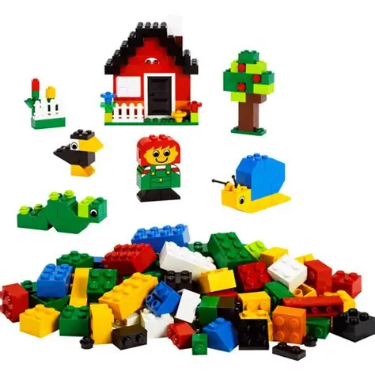
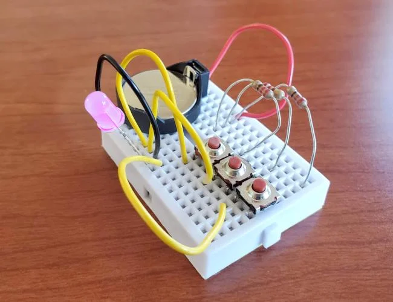

# A Library For Making "Lego-like" Interchangeable Software Components 

In software engineering, a software component is a modular, independent, and reusable unit of software that encapsulates specific functionality, with well-defined interfaces for interaction with other components. Components simplify development by allowing systems to be assembled like building blocks, encouraging reusability, maintainability, and scalability.

There are many real-world products and projects that are built using software components and component-based software engineering, such as Netflix's microservice-based and composable architecture, and Shopify's reusable React components in its Polaris design system. However, components for these architectures and systems can only work in a company's specific domain, i.e., Netflix cannot use Shopify-developed components and vice versa. 

Cross-company software components aren't interchangeable because companies' software development are isolated and independent, so it's difficult for them to agree and maintain "compatible" data models, which is required for cross-company software to exchange data and collaborate. Typically, data exchange between independently-developped software require dedicated custom-built interfaces, which is inpractical between software components.[^1]

[^1]: Using middleware products to mitigate incompatible data models in the data communication is not an effective solution because 1) component-level interfacing is too fine-grained for using middleware, and 2) the data conversion logic inside the middleware ties the interface to the data models used at either end's communicating party, making it a high-maintenance, tight-coupling solution. Besides, a middleware-based solution ties the components to the middleware product, making the components product-dependent on the middleware.

So for having generic and interchangeable software components, it's a requirement to have low-cost, easy-to-maintain component-level interfacing that is irrelavent to individual components' business requirements and internal data model changes.

## The Lego Joint "Inspiration"

**Q:** What do all Lego blocks have in common?  
**A:** They use the same type of joints for connecting to the other blocks.



The success of Lego inspires us that it is the key to a flexible universal modular architecture to have a simple and generic mechanic or method of connecting all the modules. For modular software architecture, this means it would require generic and universal component interfacing - that is, in the software terms, a standardized system and method for software component modules to exchange data, 

Snappable is a library for such generic component interfacing that allows any compatible components to connect and exchange data between each other, while allows the components to independently changing their data models. Like the simple and consistant Lego joints, the Snappable interface is "static" and maintainance-free, and it makes compatible software components "Lego-like" - meaning they are interchangeable and maintain inter-components-communication when connected, even though they are independently developed, and can freely evolve according to their individual requirements.

Another analogy for describing Snappable is the breadboard that is used for building prototype electronic circuits. By connecting electronic components and ICs' conductive metal wires and pins to a breadboard, it allows building a circuit while these independent components transmit and exchange electrical signals via their connections through the board. The electronic components such as transistors and ICs are interchangeable as long as they have pins that are compatible with standard-sized plugs (holes) on the breadboard, and the breadboard's function is simply connecting the components and direct electrical signals according to the circuit. In this analogy, the Snappable-provided interface is like the pin holes on a breadboard, and the data between the software components is like the electrical signals of a breadboard circuit.



Like in both analogies, it's the key of a software component interface that functions like Lego's joint and a breadboard's conductive wire/pin, for building generic component-based software. Snappable implements such a "joint" as a unified, universal data transport layer API, through which components can send and receive unified data containers, and these containers can accommodate arbitrarily complex data. The data transport layer keeps the components connected regardless of how different or incompatible their internal data models are - meaning they can freely evolve their internal logic and data model[^2] without breaking the connection. 

[^2]: While the data transport layer allows physically exchanging data between the components collaborative interaction, there is still a "logical" application-layer typically implemented in the components themselves, where the data is interpreted and consumed. 

When assembling a modular app, Snappable allows compatible software components to easily exchange data between each other using the provided interface without having to be committed to a fixed data model. From the application builder's perspective, these components are interchangeable because the interface they use for communication is generic and universal - just like you can change a household lightbulb as long as it fits into the standard socket. Thanks to the Snappable interface, components can be freely disconnected ("detached") from and reconnected ("re-attached") to an app, meaning components made by different vendors are interchangeable, giving assembling an application the Lego-like flexibility and experiences.

## A Working Demo

Here is a demo of using some of the pre-made components avaiable from this repo to physically assemble an ETL app.

<p align="center">
  <a href="https://www.youtube.com/watch?v=l0DjAjVoESo" target="_blank">
    
  </a>
</p>

This second clip explains how these components are configured indiviually and work collabourtively but are also interchangeable - 

<p align="center">
  <a href="https://www.youtube.com/watch?v=etm8vNLH4po" target="_blank">
    
  </a>
</p>

All the modules in the example are avaiable from this GitHub repo. Not only you can use and re-use them as in the demo, you can also, for example, use Company X's FTP module to replace the one in the example, and make it to work in a soution with your own self-developped DB-Writer module. That is how we can flexibly assemble apps using Snappable software components which are cross-compay share-able and interchangeable.

Note in the example, Foldda's component runtime implementation uses Windows folder as the 'shell' to physically represent each software components. While it is visual and intuitive, you don't have to use Foldda runtime to enjoy the benefits of Snappable interchangeable software components. Think Foldda is a specific brand of breadboard and you don't have to use a specific brand of breadboard for developping an electrical circuit. More on this later.

So how does Snappable work internally to enable these?

## CONCEPT: Schema-Neutral Data Transport

In the concept of Snappable component interfacing, the data exchange between two components is conceptually separated into two layers: the bottom layer, called the "data transport layer", is responsible for transferring the data content from one component to the other; and the top layer, called the "application layer", is responsible for interpretate the data content in the context of the application i.e., the context of the two components' interaction and collabration. The Snappable library only implements the data transport layer and the application layer is left to be implemented in the components. 

Such a logical separation is the key to the Snappable's component interfacing design. It means the Snappable library is only responsible for _connecting and passing data_ from and to the components, and not for translating or interpretating the data. This allows the data transport layer to be isolated from the application's data model (being "schema-neutral") thus any component can connect and transfer data via the generic interface it provides. The schema-neutral data transport layer is like the metal wiring from the breadboard connecting the electrical components, it is simply the path for the electrical signals passing thru, regardless of what the waveform and voltage the signals are. 

A bonus benefit of Snappable's two-layer component interfacing design is that, by leaving the responsibility of describing or interpretating the data to the application layer which resides in the components, it effectively allows loose-coupling - an important feature in modular architecture design that pevents components being overly depend on each other and resulting higher ongoing costs for maintaining compatibilities between the components.

## IMPLEMENTATION: A Universal Data Container

In Snappable' schema-neutral data transport layer, it uses a universal data container class from the Charian data serialization API for moving the data. The container class, called Rda, has a recursive, expandable multidimensional array structure; it also provides a dynamically expandable, practically unlimited storage space that any data object can fit in, so effectively it can accommodate any arbitrary structured data. 

Imagine Snappable' schema-neutral data transport operates like the post office: an Rda container is a carton box, and the Snappable component interface is the office counter where the component "customers" is the post office and the software components are the customers, when a component "customer" wants to send some data to another component, it'd firstly pack the data into an Rda container, and then send the container "box" to Snappable the data transport layer (the "post office") which delivers the container to the receiver component, which would unpack the Rda container and retrieve the stored data for consumption. In this scenario, the "packing and unpacking" processes are related to their intended data models and they are implemented by the sending and the receiving components, in the data exchange's application layer. Snappable, on the other hand, only handles the moving schemaless Rda containers "boxes" and is not affected by the components' data model changes.  

As a bonus, the Charian API allows an Rda container to be converted to and from a text string. As Strings are primary data types in most  so it can be easily passed between programs cross-language and cross-platform. Strings are  such as via in-process or remote function calls, or via networked data transfer or anything in between. So in theory, Snappable component interfacing can also be used in remote, distributed computing.

## The Component-Interfacing API  

Leveraging the RDA universal data container, the Snappable API defines how a component can become a "snappable component" by implementing the ISnappable interface (explained below), and an environment where snappable components can use to send and receive data utilizing the underlying universal data transport layer. Using the post office as the analogy, snappalbe components like a "customer" must have certain characters such as having a name/id and delivery address, and the API provides a set of methods, like a post office's counter, for these component "customers" to deposit and to collect data packages.

consisit of set of classes and functions that a  would utilize and exchange data with the other snappable components. The way how a snappable component using the provided data transport layer is very straight-forward, and can be conceptually explained as below -

n software architecture consist of a set of standardized classes and functions that plays their roles in an interactive scenario of how Snappable components can exchange data. In such highly abstracted scenario, a Snappable component is provided with a work environment consists of an input data source, and an output data sink. The component runs in a process loop, pulling input data from the input data source, do "some processing" about it, and dispose any output to the output data sink, and both the input and output data are in the form of RDA.

### ISnappable

### ISnappableManager

### IDataStore

### Working Examples Demo

Any system implementing the Snappable API can benefit from its component-based computing architecture. For example, from this repo, there is a component called "HL7Networkreceiver", which can listen on a network port for receiving incoming HL7 messages. If your application requires such a function, you can implement the ISnappableManager interface, providing a "joint" where the HL7Networkreceiver can plug into and to dispose received messages to the output data store provided by your app. 

You can also be a component developper, for example you can develop a component (implementing the ISnappable) that can covert input HL7 messages to write the data to a specialized database, and other people can use your component to join to the HL7Networkreceiver to assemble an app that can receive HL7 messages from the network and write to the database.

In these cases, both the apps and the components can be independently developped, components can be made available "on the shelf", and be used and re-used by any customer. And indeed, because of the standardized component joints, people can truely benefit from a much extended software component "market", for example, there can be many types of HL7Networkreceiver to choose from, and you can quickly swap and test and find the most suitable for you - just like choosing a light bulb from a harware store.

### Component Developper Kit

## Commercial And Industrial Usage

## Our Vision 
One objective of this project is to overcome one of the major challenge of implementing ture cross-vendor software component collabration and sharing. We have demonstrated that using the novel RDA encoding and the Charian serialization API, a small code-base API can achieve rather effective and practical component-based computing.

It shall be noted that even we are confident and positive with our code in this repo, the most value of this project is prove cross-vendor software component sharing is practically achievable, and key to this is implementing a generic data-transport layer that that features effective loose coupling to the connected components.

Through using Snapple ourselves, and through our clients, we have seen promising outcome that encourges us to continue enbrace and support this project, and we hope the software development would agree with us by sharing and same vision and hopefully benefit from, or even contribute to, what are provided here in this repo.

### Data Types Conversions

Obviosuly just because two components can be joined together and exchange data, doesn't necessarily mean they will work together smoothly, just like you can randomly connect two Lego pieces but the result may not be a interesting model that you wanted. Components work together need to understand the data they are sending and receiving. In the above exmples, the data type is the well defined HL7 message, so components designed to work with HL7 data type will work automatically. This is understandable just like a light bulb from a hardware store may only work with sockets supplies 220v AC.

Just like we have hardware circuits that can convert 220V AC to 5V DC, for cross domain, cross application data integration and interfacing, unless the receiver can handle multiple data types at once (which is possible), it is commonly require data type to be converted. In this repo, we see an example of such convertor component that converts HL7 data into delimited CSV format, so it can be written to a tabular database table.

## Snappble Runtimes

If we compare Snappable components to electrical components, such transistors or ICs, a Snappble Runtime is the software version of "breadboard", that provides the sockets and wirings to connect the components.

Through the framework API, components, even without prior knowledge of each other, can be connected and exchange data and interact with each other in an app. This lays the ground for , and by doing so, it brings many benefits, such as rapid app development, more reliable software and lower cost resulted from a high degree of software (component) re-use. In an analogy, it's much like the hardware world of using the bolts and nuts purchased from hardware stores for use in home projects. 

To achieve such a goal, the Snappable API must define what a component must implement, including - 

* For being functional, the component needs to a way to perform a specified data-processing task,
* For handling data-processing task's input and output, the component needs to have have a way to exchange data with the other Enflow components.
* For being a physical assembly (i.e. "portable"), the component needs to be referencible by an OS-level physical computer object such as a file or a folder,

In addition to these, the framework API also defines a runtime must implement to run an Enflow-component-based app, so it's vendor-neutral, meaning the apps' components can be aquiried from open markets, and components with the same functions made by different vendors are interchangiable. This YouTube video gives a visual demonstration of the intended outcome of the framework, where Enflow components are assembled into data-processing solutions that can be deployed and run in a standard-compliant runtime environment.

Below we explain how the API is designed to specify these constrains, so the components and runtimes can interact with each other, performing their intended functions, within these standardized constrains. 

## Data-process Flow Abstraction

In Emflow API's design, the process of using a component is modeled as a factory worker at a product processing line: the abstracted worker is given an "input container" which contains a co

## Connecting The Components

## Being Physical and Portable

## Standardized Runtimes

### Snappable Component Deverloper Kit

### iSnap - A Commercial Product

### iSnap Win_Service

## Summary

Truly generic software components also mean they are freely interchangeable,  "generic" software components, we need a mechanism that allows the components to flexibly interface with each other to exchange data, without being bound by their different data models (tight-coupling).

The Enflow component-based computing framework promotes high-level modular software re-use, by specifying a simple and practical open standard of software components and solution runtime, so both a component and a runtime can be independly developped, and are interchangible. 

Functional implementations of the Enflow Components and Runtime are available
pipelines for integration and data automation. "Portable" means Enflow components and assembled applications can be used on any computer[^1] without setup or installation. 

[^1]: On any Windows computers only at the moment.

Enflow leverages Charian, a universal data serializer, for connected components to exchange arbitrarily complex data, effectively allowing any Enflow-compliant components, from any person or company, to join and work together without pre-setting, and being constrained by, a data model.

> Just like a LEGO joint can connect arbitrarily shaped pieces to function as a more complex unit, Enflow works by providing a "universal joint" for coupling software components to become a bigger module or an app.

> Another analogy is that Enflow works like a breadboard where electrical components connect to it and work together as they use universal standard pins for sending and receiving signals. Enflow components send and receive data using the simple channel and format defined by the API.

This repo contains files and resources for Enflow component development, including -

1. The framework's component and runtime API, for anyone to make compatible components, with arbitrary features that can collaborate and interact with Enflow components made by any other vendors.
2. Source code of many Enflow components for various modularized tasks and functions, which can be used as they are, or as spoilerplates for further customizing a component tailored to your specific requirement.
3. An easy-to-use "Developer Kit" program with GUI allows debugging and tracing the execution of connected Enflow components in Visual Studio.

## Background: Component-Based Computing - The Challenge 

Component-based computing promises many attractive benefits with its modularized architecture and interoperability feature, including better reusability, scalability, maintainability, and flexibility. However, implementing such a system has proven challenging and very few have succeeded. One fundamental problem to be addressed when implementing component-based computing is how components are going to connect and exchange data - to achieve maximum interoperability, minimum assumptions should be made between components about each other's data model and behavior, on the other hand, there shall be a level of "agreement" (i.e. a protocol) between the connected components about what and how data are exchanged for an interactive transaction. Note any such agreement being established would inevitably set a boundary to components about what can and cannot be done, so one of the design challenges for a true interoperable component-based computing system is to have the data exchange protocol as flexible as possible while maintaining operatable.

> Einstein once said: Everything should be made as simple as possible, but not simpler.

One example of such an agreement is the REST API where schema 

The ultimate goal of Enflow Component API is to become the base of an open-sourced software component marketplace, where free and premium components from different vendors are made available for people to assemble apps without programming. Not only component-based software development is much more productive and easier to maintain as you see in the demo, but a market of software components also has great economic value because it encourages a very high degree of software reuse. Theoretically, when a new component is developed and added to the market's collection, the number of possible apps from these components would multiply and grow exponentially, and, unlike using hardware electronic components, software components can be easily copied and reused in an app without much effort or additional cost. 

In the past, despite these attractive benefits, one thing that stopped realizing component-based computing was how to define "a component's boundary" so it could co-exist and collaborate with the other components in an app. We need a standard interface that allows software components to freely and meaningfully exchange data.

Foldda Enflow is an attempt to solve the above problem, that is, it defines and implements such a "universal interface", for software components to exchange data while working together - even if the components are from different vendors, or developed at various times, and have little or no pre-established knowledge of each other[^1]. 

[^1]: This feature is called "late binding" in software engineering.

## Enflow: Defining A Simple Component-Based Computing Framework

In an analogy, Enflow Components works much like "the breadboard for software" which essentially is a framework for simple and practical component-based computing. That is, like a breadboard defining the intended electric signals between electrical components and how they are connected, the API defines a generic data package standard for exchanging between software components and defines the interface of how each component can be connected and collaboratively function together in a runtime environment like Enflow. Think of a defining "universal plug" for software components that works like the pins and pin-holes in a physical breadboard project. Also, for a software component operatable like a physical electrical component, it has to be data-model-neutral, meaning the data exchange cannot be bound to a specific data model controlled by a vendor - think "the pin" and "pin-hole" for the breadboard have to be neutral and generic. 

<div align="center">

</div>

Based on the "pins" and "plugs" defined by the API. "Off-the-shelf" Enflow components can be made by any third party, giving you unrestricted choices of vendors for software components which you can use to create custom data processing and automation pipelines. And of course, you can also create components yourself without depending on a vendor. 

## "Breadboard-Like" App-Building Operations 

An Enflow project (called a "solution") consists of a selection of components (called "handlers") that collectively work together to perform an application. Unlike the other modular software development frameworks, where software modules only exist in a proprietary IDE environment, Enflow components are packaged as file system folders, which can be physically carried in a USB, and be built into an app using plain Windows desktop operations such as drag-and-drop - i.e. without the need of an IDE. That is why building a Foldda app is more like a breadboard project except the outcome is a software application. This [short video below](https://www.youtube.com/watch?v=l0DjAjVoESo) is a demo of building and running an ETP pipeline with Foldda components.

[](https://www.youtube.com/watch?v=l0DjAjVoESo)

As seen in the video, app-building with Enflow components does not require any vendor-specific tool, which means you can build or change an "Enflow app" from any _bare_ Windows computer. 

## Using This Repo

To achieve organic growth for the intended software component market, Enflow Framework must allow a user to modify a component, or to create new components, according to his/her specific requirement, rather than trying to provide a large number of components and try to satisfy all users' needs. So the API is designed to be (extremely) simple, flexible, and non-restrictive.

This repo hosts the open-sourced Foldda Automation API as well as the source code of many quality components developed by Foldda according to the API. These components can be used as they are, as you saw in the video, or serve as a boilerplate for you to customize or to start a brand-new component development, to suit your specific requirements. It is hoped these source codes will assist developers in understanding and developing their compatible software components.

The "Developer Kit" project included in this repo is a simple reference runtime. It is also designed to be used for the convenience of custom handler development as you can use it to debug your components' code by following a data processing flow across components.

# The Framework - Technical Details 

In a Foldda app, each folder encapsulates a specific function of a data-processing step, the parent-children relationship of the stacked folders defines the data flow of the processing.

<<A pic of Foldda program flow>>

When a Foldda app executes in a runtime, each module's logic (a specific data-process step) is turned into a process by the runtime, and the app's intended data-processing is performed sequentially as laid out by the folder's hierarchical structure.

<< foldda app execution with runtime >>

# Foldda Handler Explained - A Design Analogy

The framework is modeled as a factory processing line, where a worker (known as a "handler") takes items from an input bucket, processes them, and places the processed items (or other types of output) into an output bucket.

The Foldda "runtime" is the work environment for the workers, which includes providing the worker its input bucket, and output bucket, and, if applicable, passing the output from a worker to the next worker.

So in a Foldda handler, all it does is take data records from the provided input container, do the intended processing to these records, and then place the produced output to the provided output container. As defined by the framework, a Foldda handler would implement the IDataHandler interface - 

```csharp
  public interface IDataHandler
  {
      /// Setting up the data-handler "worker" with its config, and its input and output storage 
      void Setup(IConfigProvider config, IDataStore inputStorage, IDataStore ouputStorage);

      /// Typically runs a processing loop that processes the input records and saves the output records to the output storage.
      Task ProcessData(CancellationToken cancellationToken);
  }
```

## Framework API Overview

## Charian - Universal Data Exchange

A Foldda runtime needs to address the problem of defining and implementing the interface between the components - which can be potentially independently developed and have no assumed knowledge of one other. And that is another key piece of tech from Foldda - the Charian object serialization API.

With Charian, Foldda runtime has this real power which is that it allows plug-n-play of third-party developed handlers that would work with existing handlers without having to recompile the app. It means you can have a handler built to your specific requirements while taking advantage of the existing prebuilt handlers, which means ultimate flexibility and control. And when a newly developed handler combines with the existing handlers, it multiplies the number of possible apps that can be built.

This allows Foldda Runtime to function as "the (software) breadboard", i.e. it powers up, and connects the input and the output of, the handler modules. More technically speaking, it navigates through a Foldda solution's folder hierarchy, executes the instructions in each module's folder, and provides data exchange between connected modules. An example of Foldda runtime is the Foldda Windows app.


## Handlers

## Runtimes

### Developer Kit


