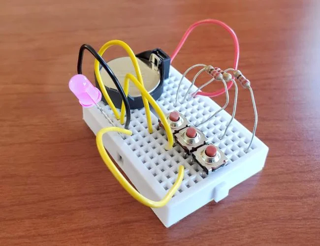

# Building Interchangeable Software Components

In software engineering, a software component is a modular, independent, and reusable unit of software that encapsulates specific functionality, with well-defined interfaces for interaction with other components. Components simplify development by allowing systems to be assembled like building blocks, encouraging reusability, maintainability, and scalability.

There are many real-world products and projects that are built using software components and component-based software engineering, such as Netflix's microservice-based and composable architecture, and Shopify's reusable React components in its Polaris design system. However, these components can only work in a company's specific domain and aren't interchangeable, i.e., Netflix cannot use Shopify-developed components and vice versa. 

## The Problem

If software components made by different companies are interchangeable, it means their collaboration is through a consistant mechanism, including using a pre-agreed static data model for any underlying data exchange. This is difficult because the data model would ahere to each company's functional and business requirements, which are often evolving over time. 

So instead of interchanging plug-n-play software modules, extra work are often required to "integrate" two pieces of independently developed software, for their collaboration and exchanging data. For integrating larger scale applications, it typically requires building and maintaining dedicated middleware to bridge incompatible data models, but such an approach is impractical at the software components' granularity.

Indeed, for implementing true interchangeable software components, we need a generic and consistent and static way for the components to collaborate, specifically, we need a generic plug-n-play component data-exchanging inteface, for all the current and future components, and such an interface cannot have a restricting data model because every component's data model is dynamically depend on its business and functional requirements and may (inevitably) change over time.

## Building a software component breadboard

Snappable is a component-based software framework. It's core concept works like a software version of the breadboard, which is a tool used for wiring electrical components and developing prototype electronic circuits. Connecting electronic components and ICs' conductive metal wires and pins to a breadboard allows building a circuit, while these independent components transmit and exchange electrical signals through the connections provided by the board. The electronic components, such as transistors and ICs, are interchangeable as long as they have pins that are compatible with standard-sized plugs (holes) on the breadboard, and the breadboard's function is simply connecting the components and directing electrical signals according to the circuit.



Similarly, just like a breadboard's pin-holes and wires, the Snappable framework defines and implements the "joint" that connects software components, allowing simple and unified connection and data exchange. As in the analogy, the Snappable "breadboard" provides the functions of pin holes and wirings, through a unified, universal data transport layer API, through which components can send and receive unified data containers, and these containers can accommodate arbitrarily complex data. Using a technique known as [late-binding](), the data transport layer keeps the components connected regardless of how different or incompatible their internal data models are, which means it allows any compatible components to plug-and-play without re-compilation.

From a component vendor's perspective, software components can be independently developed because the provided data transport layer allows exchanging data between the components without having to be committed to a fixed data model. 

From a component consumer's perspective, the interchangeable Snappable components are just like you can change a household lightbulb as long as it fits into the standard socket - because the interface components use for communication is generic and universal. 

> So essentially, Snappable is a framework of data connections with sockets for connecting exchangeable software components - think of it as a wired house with sockets where you can plug in lightbulbs and electrical appliances.

## A Working Demo

Let's take a look at a working demo to visualize using the exchangeable components proposed above. This video below shows assembling an ETL app using pre-made Sanppable components which are avaiable from this repo.

<p align="center">
  <a href="https://www.youtube.com/watch?v=l0DjAjVoESo" target="_blank">
    
  </a>
</p>

This second clip explains how these components are configured indiviually and work collabourtively but are also interchangeable - 

<p align="center">
  <a href="https://www.youtube.com/watch?v=etm8vNLH4po" target="_blank">
    
  </a>
</p>

The program doing the demos is called [SnapFusion](https://foldda.com/snapfusion/), it contains a "runtime" environment that conforms the Sanppable API for providing the joining linkage connecting the components and implementing the data communication for the components data exchange needs[^3]. From the fast development of modular apps perpsective, it may not appear to be anything exciting, but the true value of the Snappable API is that it _defines_ "Snappable components" and the corresponding runtimes, based on which companies and developpers can make compatible components and runtimes that are interchangeable or be used together. In other words, you don't have to commit to use Foldda's SnapFusion runtime to take advantage the available Snappable components, and any Snappable-compatible components can be used with any Snappable-compatible runtimes[^4], or to be used in any general app as extension funtional modules (via the Snappable API).

[^3]: Foldda SnapFusion uses a Windows folder for wrapping and representing a software component where the files content inside the folder contains information, such has location pointers, about the actual software component being used. While it is visual and intuitive, you don't have to use Foldda runtime to enjoy the benefits of Snappable interchangeable software components. Just like you don't have to use a specific brand of breadboard for developping an electrical circuit, think Foldda is a specific brand of software-version of  breadboard. 

[^4]: In fact, the Developper Kit project from this open-source repo is another fully functional runtime, although it is designed for developping and testing Snappable components. 

## Who Would Use Snappable Components

Application builder - taking advantage of all available market components from all companies - loosely-coupled modular architecture leads to faster app development cycle, component interchangeablility leads to more choices, meaning portentially lower cost and higher quality thanks to competition.

Component developer - developing components that can be greatly re-used and easier to maintained, for bigger market.

Integration builder - connecting applications through using standard component-interface or by implementing lightweight "adaptor" components to bridge incompatible data models, rather than using high-cost middleware systems.

So how does Snappable work internally to deliver these benefits?

## CONCEPT: Data exchange late-binding

Snappable conceptually separates the components data exchange into two layers: the bottom layer, called the "data transport layer", is responsible for transferring the data content from one component to the other; and the top layer, called the "application layer", is responsible for interpretating the data content in the context of the application i.e., the context of the two components' interaction and collabration. The Snappable library only implements the data transport layer and the application layer is left to be implemented in the components. 

Such a logical separation is the key to Snappable's software-component architecture, as the data transport layer is "the Lego joint" equivlant for component interfacing. Because the Snappable library is now only responsible for _connecting and passing data_ from and to the components, and not for translating or interpretating the data, the generic interface it provides can be "schema-neutral" (i.e., being immute from the application's data model changes) and allow any component to connect and transfer data. The schema-neutral data transport layer is like the metal wiring from the breadboard connecting the electrical components, it is simply the path for the electrical signals passing thru, regardless of what the waveform and voltage the signals are. 

And, by leaving the responsibility of describing or interpretating the data to the application layer which resides in the components, it elimites logical dependency to the physical connection and allows greater flexibility and lower costs in maintaining the components and the application.

## IMPLEMENTATION: Data Transport Using Universal Data Container

In Snappable' schema-neutral data transport layer, it uses a _universal data container class_ from the Charian data serialization API for moving the data. The container class, called Rda, has a recursive, multidimensional array structure which is also dynamically expandable. It provides a practically unlimited storage space that effectively can accommodate any arbitrary structured data. 

The Snappable' schema-neutral data transport operates like the Post Office where everything are packaged inside carton boxes. In this analogy, the Snappable component interface is like the office counter where the components are the "customers" who send and receive their data via the "counter" using the provided Rda container "boxes". When components require exchanging data, they would be exchanging Rda containers through via the  data transport layer (the "post office") provided by the Snappable API. Later, a component must unpack the Rda container to retrieve the stored data for consumption[^3] and the unpacking and consuming data operations are the application layer inside compoments themselves.

[^3]: As a bonus, the Charian API allows an Rda container to be converted to and from a text string. As Strings are primary data types in most so it can be easily passed between programs cross-language and cross-platform. Strings are  such as via in-process or remote function calls, or via networked data transfer or anything in between. So Snappable component interfacing can also be used in remote, distributed computing.

So essentially, Snappable is an API for components to freely exchage data, and it does so by defines a schema-neutral data transport layer where data are inside the unified Rda containers. The "container packing and unpacking" processes which are related to application-specific data models are responsible by the sending and the receiving components, in their application-specific implementation. By separating the two layers, data transport can becoming simple and unified and not being affected by the components' data model changes - we have now a Lego joint for joining components.  

## DETAILS: The Component-Interfacing API  

Leveraging the RDA universal data container, the Snappable API defines how a component can become a "snappable component" by implementing the ISnappable interface (explained below), and an environment where snappable components can use to send and receive data utilizing the underlying universal data transport layer. Using the post office as the analogy, snappalbe components like a "customer" must have certain characters such as having a name/id and delivery address, and the API provides a set of methods, like a post office's counter, for these component "customers" to deposit and to collect data packages.

consisit of set of classes and functions that a  would utilize and exchange data with the other snappable components. The way how a snappable component using the provided data transport layer is very straight-forward, and can be conceptually explained as below -

n software architecture consist of a set of standardized classes and functions that plays their roles in an interactive scenario of how Snappable components can exchange data. In such highly abstracted scenario, a Snappable component is provided with a work environment consists of an input data source, and an output data sink. The component runs in a process loop, pulling input data from the input data source, do "some processing" about it, and dispose any output to the output data sink, and both the input and output data are in the form of RDA.

### ISnappable

An abstraction of a Snappable component.

### ISnappableManager

Post office counter and staff that facilitate the data transport.

### IDataStore

A standardized data storage for holding data.

## How to Use This Repo

Any system implementing the Snappable API can benefit from its component-based computing architecture. For example, from this repo, there is a component called "HL7Networkreceiver", which can listen on a network port for receiving incoming HL7 messages. If your application requires such a function, you can implement the ISnappableManager interface, providing a "joint" where the HL7Networkreceiver can plug into and to dispose received messages to the output data store provided by your app. 

You can also be a component developper, for example you can develop a component (implementing the ISnappable) that can covert input HL7 messages to write the data to a specialized database, and other people can use your component to join to the HL7Networkreceiver to assemble an app that can receive HL7 messages from the network and write to the database.

In these cases, both the apps and the components can be independently developped, components can be made available "on the shelf", and be used and re-used by any customer. And indeed, because of the standardized component joints, people can truely benefit from a much extended software component "market", for example, there can be many types of HL7Networkreceiver to choose from, and you can quickly swap and test and find the most suitable for you - just like choosing a light bulb from a harware store.

### Component Developper Kit


## License & Commercial Use

This project is released under **GPL‑3.0** for open‑source use.

If you want to use it in a **proprietary or closed‑source product**, or distribute it without GPL obligations, a **commercial license is available**.

Commercial licensing offers:
- Permission for closed‑source usage
- Legal clarity for enterprises
- Optional support & long‑term maintenance

📧 contact@foldda.com


## Our Vision 
One objective of this project is to overcome one of the major challenge of implementing ture cross-vendor software component collabration and sharing. We have demonstrated that using the novel RDA encoding and the Charian serialization API, a small code-base API can achieve rather effective and practical component-based computing.

It shall be noted that even we are confident and positive with our code in this repo, the most value of this project is prove cross-vendor software component sharing is practically achievable, and key to this is implementing a generic data-transport layer that that features effective loose coupling to the connected components.

Through using Snapple ourselves, and through our clients, we have seen promising outcome that encourges us to continue enbrace and support this project, and we hope the software development would agree with us by sharing and same vision and hopefully benefit from, or even contribute to, what are provided here in this repo.

### Data Types Conversions

Obviosuly just because two components can be joined together and exchange data, doesn't necessarily mean they will work together smoothly, just like you can randomly connect two Lego pieces but the result may not be a interesting model that you wanted. Components work together need to understand the data they are sending and receiving. In the above exmples, the data type is the well defined HL7 message, so components designed to work with HL7 data type will work automatically. This is understandable just like a light bulb from a hardware store may only work with sockets supplies 220v AC.

Just like we have hardware circuits that can convert 220V AC to 5V DC, for cross domain, cross application data integration and interfacing, unless the receiver can handle multiple data types at once (which is possible), it is commonly require data type to be converted. In this repo, we see an example of such convertor component that converts HL7 data into delimited CSV format, so it can be written to a tabular database table.

## Snappble Runtimes

If we compare Snappable components to electrical components, such transistors or ICs, a Snappble Runtime is the software version of "breadboard", that provides the sockets and wirings to connect the components.

Through the framework API, components, even without prior knowledge of each other, can be connected and exchange data and interact with each other in an app. This lays the ground for , and by doing so, it brings many benefits, such as rapid app development, more reliable software and lower cost resulted from a high degree of software (component) re-use. In an analogy, it's much like the hardware world of using the bolts and nuts purchased from hardware stores for use in home projects. 

To achieve such a goal, the Snappable API must define what a component must implement, including - 

* For being functional, the component needs to a way to perform a specified data-processing task,
* For handling data-processing task's input and output, the component needs to have have a way to exchange data with the other Enflow components.
* For being a physical assembly (i.e. "portable"), the component needs to be referencible by an OS-level physical computer object such as a file or a folder,

In addition to these, the framework API also defines a runtime must implement to run an Enflow-component-based app, so it's vendor-neutral, meaning the apps' components can be aquiried from open markets, and components with the same functions made by different vendors are interchangiable. This YouTube video gives a visual demonstration of the intended outcome of the framework, where Enflow components are assembled into data-processing solutions that can be deployed and run in a standard-compliant runtime environment.

Below we explain how the API is designed to specify these constrains, so the components and runtimes can interact with each other, performing their intended functions, within these standardized constrains. 

## Data-process Flow Abstraction

In Emflow API's design, the process of using a component is modeled as a factory worker at a product processing line: the abstracted worker is given an "input container" which contains a co

## Connecting The Components

## Being Physical and Portable

## Standardized Runtimes

### Snappable Component Developer Kit

### SnapFusion - A Commercial Application

### SnapFusion Win_Service

## Summary

# Foldda Handler - The Design Concept

All components connect to the framework though a standardized "handler" interface, which is modeled on an analogy of a factory processing line: a worker (a "handler") takes items from an input bucket, processes them, and places the processed items (or other types of output) into an output bucket.

The framework provides a work environment for the workers called a "runtime", which is responsible for providing the worker an input bucket, an output bucket, and, if applicable, passing the output from a worker to the next worker.

So for a Foldda handler, its task is simplified as taking data records from the provided input container, "processing these records", and then placing the output to the provided output container. Thus the most important part of a handler, as defined by the framework's IDataHandler interface, is to implement the following -  

```csharp
  public interface IDataHandler
  {
      /// Setting up the data-handler "worker" with its config, and its input and output storage 
      void Setup(IConfigProvider config, IDataStore inputStorage, IDataStore ouputStorage);

      /// Typically runs a processing loop that processes the input records and saves the output records to the output storage.
      Task ProcessData(CancellationToken cancellationToken);
  }
```

## Handlers

## Runtimes

### Developer Kit


