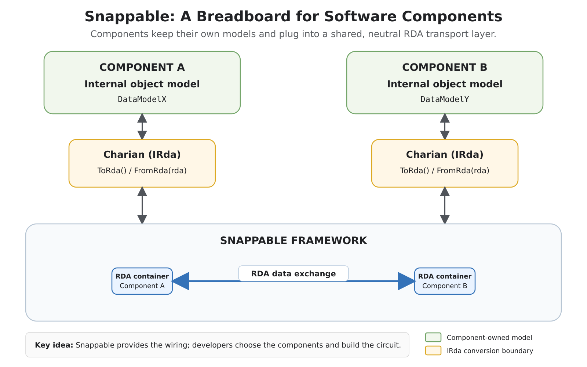

# Snappable — A Breadboard for Software Components

Snappable is a software-component framework for building applications from independently developed components.

Instead of coupling a component to one host application's interfaces and domain-object model, Snappable provides neutral, standardized "wiring": components exchange data through evolvable [RDA](https://github.com/foldda/rda) containers and can be connected and driven by different Snappable runtimes.

Like a physical breadboard, Snappable does not decide whether the connected components are functionally compatible or whether the resulting "circuit" is correctly designed. Component developers define and understand their components' data and functional contracts; application builders select suitable components and connect them correctly.

## Background: The Problem

A software component is a modular unit that encapsulates a specific capability behind a well-defined interface. Component-based systems can be easier to assemble, extend, test, and maintain than monolithic applications.

Visual Studio Code extensions and Adobe Photoshop plugins are familiar examples. Both demonstrate the value of letting third parties extend an application. However, a VS Code extension cannot be loaded into Photoshop, and a Photoshop plugin cannot be used by VS Code. Each component is designed around its host's API, lifecycle, and domain-object model.

This is true of most plugin and extension architectures: they create useful component ecosystems, but those ecosystems are closed around a particular host. A component that could be useful elsewhere must usually be adapted or rewritten for every new framework.

Snappable separates two concerns:

- The **host or runtime** connects components and directs the flow of data.
- Each **component** interprets that data through its own model and performs its own specialised work.

The runtime does not need to adopt the component's domain model, and the component does not need to compile against the runtime's domain classes. The boundary is based on RDA and the Snappable conventions.

This removes a major source of host coupling. It does not remove the need for meaningful component contracts: two components can work together only when their functions and their interpretations of the exchanged data are compatible.

## A Breadboard for Software

Snappable takes its central analogy from the breadboard used to prototype electronic circuits.

<p align="left">
  
</p>

A physical breadboard provides neutral electrical connections between the components plugged into it. It does not need to understand what a resistor, capacitor, switch, or integrated circuit does. It also does not guarantee that the chosen parts have compatible voltages or that the circuit will perform a useful function. Those decisions belong to the circuit designer.

Snappable plays the equivalent role for software:

- It provides common connections through which components exchange RDA containers.
- It remains neutral about each component's internal data model and business logic.
- It lets a runtime arrange components into a working data-flow circuit.
- It leaves functional compatibility and correct composition to component developers and application builders.

<p align="left">
  
</p>

In the diagram:

- **Component A** and **Component B** are independently developed components with their own internal models, `DataModelX` and `DataModelY`.
- **`IRda`** is the conversion boundary through which each component translates between its own model and an RDA container.
- **Snappable** is the neutral connection layer. It transports RDA containers without needing to know the component's internal object model.
- A **Snappable runtime** loads, connects, configures, and drives components to form an application.

If `DataModelX` and `DataModelY` express compatible information, the components can communicate directly. If they do not, an appropriate mapping or transformation component may be required—just as a circuit may need an adapter or voltage converter between otherwise incompatible parts.

When components understand compatible data and fulfil compatible roles, they can work together. Components implementing the same contract can potentially be substituted. Snappable provides the foundation that makes this composition, reuse, and potential interchangeability possible—it does not claim that arbitrary components are automatically compatible.

> **Snappable provides the wiring. Developers design the circuit.**

## Working Demos

Snappable is not only a proposal for how software components might work. The API, runtime implementations, and a growing set of components are functional today.

[SnapFusion](https://foldda.com/snapfusion/) is a visual Snappable runtime in which existing components can be selected, configured, and connected into useful data-processing applications. Its hierarchical data-flow structure lets builders rearrange processing steps and replace suitable components without rebuilding the entire application.

Click image below to watch a YouTube demonstration that shows an ETL application being assembled from pre-built Snappable components:

<p align="left">
  <a href="https://www.youtube.com/watch?v=l0DjAjVoESo" target="_blank">
    
  </a>
</p>

The second demonstration shows how components are configured individually, collaborate through the runtime, and can be replaced when another component fulfils a compatible role:

<p align="left">
  <a href="https://www.youtube.com/watch?v=etm8vNLH4po" target="_blank">
    
  </a>
</p>

The Component Developer Kit included in this repository provides another, deliberately simple runtime: a one-direction pipeline that drives data through three connected components. Together, the Developer Kit and SnapFusion demonstrate that the same component model can support runtimes with very different interfaces and data-flow structures.

These implementations already deliver practical value. They also demonstrate the larger potential: an ecosystem in which components are built around focused capabilities rather than around one vendor-specific host.

## How Components Exchange Data

Snappable is built on two other Foldda projects:

- [RDA](https://github.com/foldda/rda) provides the self-describing, delimiter-based data container used for exchange.
- [Charian](https://github.com/foldda/charian) converts component-specific data models to and from the data-model-neutral RDA.

Charian's `IRda` interface defines the conversion boundary:

```csharp
public interface IRda
{
    void FromRda(Rda rda);  // reconstruct this object's state from an RDA container
    Rda ToRda();             // represent this object's state as an RDA container
}
```

`ToRda()` converts a component's model into a neutral container. `FromRda()` attempts to reconstruct the model from values in an incoming container and reports an error when required values cannot be matched.

This approach does **not** make unrelated models semantically identical. Its purpose is to remove the requirement for components and runtimes to share the same compiled domain classes. Compatibility still depends on the data and functional contracts understood by the participating components.

Because matching occurs at runtime, data representations can also evolve more flexibly. A component can concentrate on the values it understands rather than forcing every participant to depend on one centrally compiled object model.

## Runtimes Connect and Drive Components

A Snappable runtime provides the environment in which components are loaded, configured, connected, and executed. A runtime is a role rather than a prescribed user interface or data-flow design.

It may be:

- a small host that connects and drives a single component;
- a linear pipeline such as the Component Developer Kit;
- a branching or hierarchical processing graph such as SnapFusion; or
- another host designed for a specialised application or market.

The runtime controls the connections and movement of RDA containers. Each component remains responsible for interpreting its input, performing its function, and producing its output.

This separation allows a component to be used by different Snappable runtimes without being redesigned around each runtime's domain-object model. When another component implements a compatible functional and data contract, an application builder may also substitute it without changing unrelated parts of the circuit.

## What Snappable Provides—and What It Does Not

### Snappable provides

- A host-neutral way for components to exchange data through RDA containers.
- A common component and runtime convention for connecting and directing data flow.
- Separation between a component's internal model and a host's domain-object model.
- A foundation for composing independently developed components.
- The possibility of reusing a component in different Snappable runtimes.
- The possibility of substituting components that implement compatible contracts.
- An architecture that allows data-processing applications to be rearranged and extended component by component.

### Component and application developers remain responsible for

- Defining the meaning and constraints of a component's inputs and outputs.
- Determining whether two components' data and functions are compatible.
- Selecting the correct components for an application.
- Adding mapping or transformation where representations differ.
- Connecting components in an order and structure that produces a valid result.
- Testing and validating the completed software circuit.

Snappable therefore enables composition and potential interchangeability; it does not promise that every Snappable component can be connected meaningfully to every other one.

## Why Build with Snappable?

### For component developers

- Build a focused capability without adopting a particular host application's domain classes.
- Reuse the same component in runtimes with different interfaces and data-flow structures.
- Concentrate on the component's own data and functional contract.
- Offer alternative implementations with different features, performance, support, or price.
- Improve a component independently without redesigning an entire application.

### For application and runtime builders

- Assemble applications from focused processing components.
- Add, rearrange, or replace suitable components without changing unrelated components.
- Choose among compatible implementations instead of depending on a single built-in feature.
- Keep the runtime focused on composition and execution rather than every component's internal model.
- Create specialised runtime experiences while continuing to use the common Snappable component foundation.

The long-term opportunity is an open component ecosystem in which developers can produce competing and complementary components, and application builders can compose them into software for purposes the original component authors may not have anticipated.

## Build with Snappable

Choose the guide that matches what you want to build:

- **[Building a Snappable Component](docs/Building-Components.md)** — implement the component pattern, convert models through RDA, and explore worked examples from this repository.
- **[Implementing the Snappable Runtime API](docs/Implementing-the-Runtime-API.md)** — host the Snappable API, load and connect components, and use the Component Developer Kit as a reference implementation.

The APIs and core components from this repositry are functional, although interfaces may continue to evolve. Feedback, experiments, and contributions are welcome.

## Get Involved

Snappable's broader value will grow with the number and variety of compatible components and runtimes built around it.

### Build and share components

Create focused components that solve real problems and document their input, output, and functional contracts. Each useful component expands the range of applications that can be composed from the ecosystem.

### Build new runtimes

Explore different ways to connect and operate components: visual designers, embedded pipelines, automated services, specialised industry tools, or other runtime experiences.

### Add API and component tests

The Snappable API is intentionally small, but thorough compatibility, lifecycle, failure, and integration tests are important for a framework that connects independently developed software.

### Improve documentation and examples

Help explain the breadboard model, component contracts, runtime implementation, data evolution, and practical composition patterns. Additional end-to-end examples will make it easier for developers to assess and adopt the framework.

## License and Commercial Use

This project is released under **GPL-3.0** for open-source use.

If you want to use it in a proprietary or closed-source product, or distribute it without GPL obligations, a commercial license is available.

Commercial licensing offers:

- Permission for closed-source usage
- Legal clarity for enterprises
- Optional support and long-term maintenance

Contact the project owner at contact@foldda.com with questions or enquiries.

