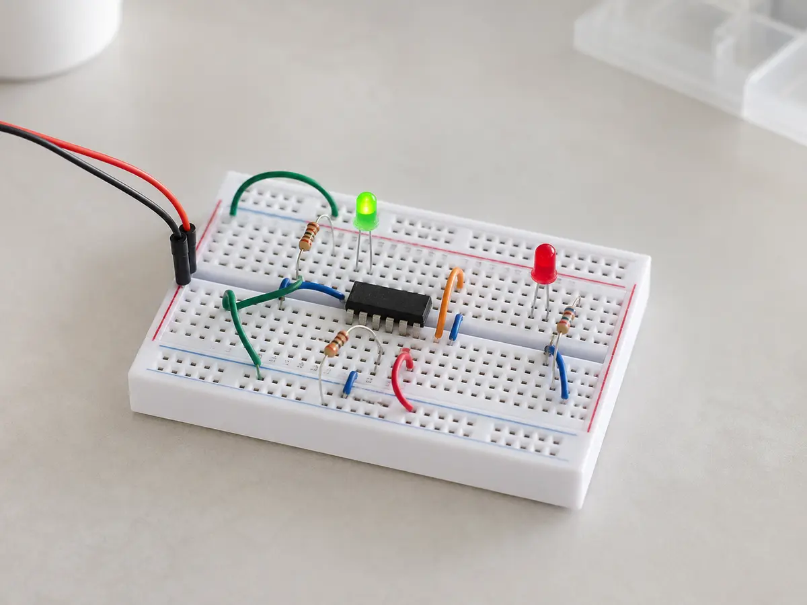
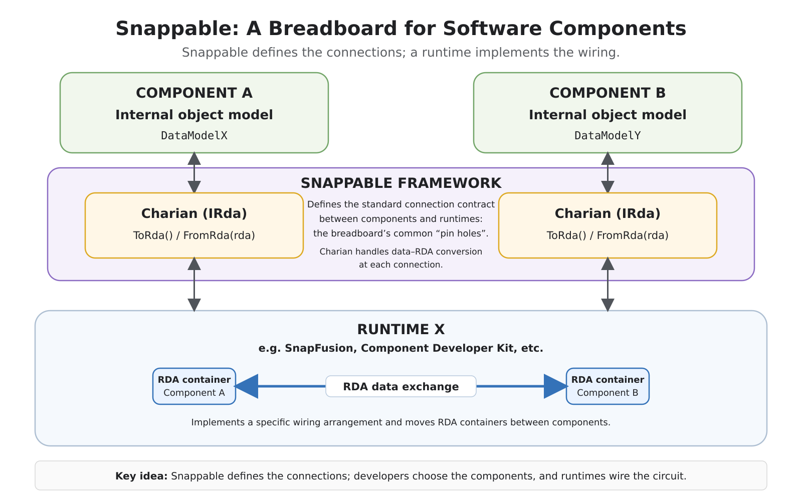

# Snappable — Runtime-Portable Software Components

**Build a component once. Compile it once. Host the same compiled component unchanged in different Snappable-compatible runtimes.**

Snappable is a framework that defines a common contract for building applications from independently developed software components. It standardises the connection between a component and the runtime that hosts it, so the component depends on Snappable rather than on one particular application's API or domain-object model.

Different runtimes can offer completely different interfaces, execution models, and data-flow structures while exposing the same Snappable connection. The **Component Developer Kit** and **SnapFusion** demonstrate this today: a component developed and tested in the Developer Kit can be loaded and used in SnapFusion without recompilation or source-code changes.

Snappable builds on two other Foldda projects:

- [RDA](https://github.com/foldda/rda) provides the neutral data containers exchanged between components.
- [Charian](https://github.com/foldda/charian) converts a component's own object model to and from RDA through its `IRda` interface — a pattern called **self-binding**.

## Contents

- [The Problem](#the-problem)
- [The Breadboard Analogy](#the-breadboard-analogy)
- [Snappable Advantages: Portability, Composability, and Interchangeability](#snappable-advantages-portability-composability-and-interchangeability)
- [Demo: Portable Components Across Runtimes](#demo-portable-components-across-runtimes)
- [Who Snappable Is For](#who-snappable-is-for)
  - [Component developers](#component-developers)
  - [Application builders](#application-builders)
  - [Runtime developers](#runtime-developers)
- [Get Involved](#get-involved)
- [License and Commercial Use](#license-and-commercial-use)

## The Problem

Plugin systems make applications extensible, but their components normally belong to one host. A Visual Studio Code extension is built for Visual Studio Code; a Photoshop plugin is built for Photoshop. Each depends on its host's API, lifecycle, and often its domain-object model.

Even when a component's underlying function would be useful elsewhere, moving it to another host normally requires an adapter, source-code changes, or a complete rewrite.

Snappable separates the component from the runtime implementation. A component targets one common Snappable contract, and any compatible runtime implements the corresponding hosting contract. This makes the compiled component **host-neutral** and **runtime-portable** within the supported Snappable and platform versions.

## The Breadboard Analogy

Snappable takes its central analogy from a breadboard used to prototype electronic circuits.

<p align="left">
  
</p>

A physical breadboard provides standard connection points into which electronic components can be plugged. Different breadboards may wire those points into different circuits, but a compatible component does not have to be rebuilt for each breadboard.

Snappable applies the same separation to software:

| Breadboard concept | Snappable equivalent |
|---|---|
| Electronic component | Independently compiled software component |
| Standard connection point | Snappable component–runtime contract |
| Electrical signal | RDA container |
| Component lead or pin | Charian `IRda` conversion boundary |
| Wired breadboard | A Snappable-compatible runtime |
| Completed circuit | A component-based application |

The Snappable framework defines the standard connections. A runtime implements a particular wiring arrangement by loading, configuring, connecting, and driving components.

<p align="left">
  
</p>

The breadboard does not decide whether an electronic circuit is valid, and Snappable does not decide whether two software components perform compatible functions. Developers still choose appropriate components and design the application circuit.

## Snappable Advantages: Portability, Composability, and Interchangeability

These terms describe different properties and should not be confused:

| Term | Meaning in Snappable | Provided by Snappable? |
|---|---|---|
| **Runtime-portable** | The same compiled component can run unchanged in different compatible runtimes | Yes — this is a core purpose |
| **Pluggable** | A component can connect to a runtime exposing the compatible Snappable contract | Yes |
| **Composable** | A runtime can connect components into an application data flow | Yes, structurally |
| **Data-compatible** | Connected components understand compatible meanings and representations | Determined by their data contracts |
| **Functionally interchangeable** | One component can replace another in the same application role | Only when their functional and data contracts are compatible |

Snappable guarantees a standard route to runtime portability and pluggability. It does **not** claim that arbitrary components are functionally equivalent.

If two components understand compatible RDA data, they can communicate directly. If their representations differ, the application may require a mapping or transformation component. If two components fulfil the same functional and data contracts, a runtime builder may substitute one for the other without changing unrelated components.

Four elements work together in the Snappable architecture:

1. A **Snappable component** contains a focused capability and owns its internal object model.
2. **Charian (`IRda`)** converts between that internal model and a neutral RDA container at the Snappable connection boundary.
3. The **Snappable framework** defines the common contract through which the compiled component connects to a runtime.
4. A **Snappable-compatible runtime** implements that contract, controls component lifecycle and execution, and moves RDA containers through its chosen data-flow structure.

For example, Component A may use `DataModelX`, while Component B uses `DataModelY`. Neither model has to be compiled into the runtime. Each component performs its own model–RDA conversion, and the runtime carries the resulting RDA containers without adopting or interpreting either model.

Charian's `IRda` interface provides the model-conversion mechanism:

```csharp
public interface IRda
{
    void FromRda(Rda rda);  // reconstruct this object's state from an RDA container
    Rda ToRda();             // represent this object's state as an RDA container
}
```

`ToRda()` converts an object's state into an RDA container. `FromRda()` reconstructs the object from an incoming container and reports an error when required values cannot be matched. Because the object resolves its own fields at runtime instead of depending on a compiled schema shared with the host, this pattern is called **self-binding**.

The result is separation on two levels:

- **Runtime separation:** the component targets Snappable, not one particular runtime implementation.
- **Model separation:** the runtime transports RDA containers without depending on the component's domain classes.

## Demo: Portable Components Across Runtimes

Snappable is not merely an architectural proposal. Its API, runtime implementations, and components are functional today.

The **Component Developer Kit** included in this repository is a deliberately simple development and testing runtime. It provides a one-direction pipeline in which developers can build, configure, execute, and test Snappable components.

After compilation, the same component can be loaded and used unchanged in [SnapFusion](https://foldda.com/snapfusion/). SnapFusion is a substantially different runtime: it provides a visual, hierarchical environment for composing data-processing applications. The component does not need to be recompiled, rewritten, or adapted to SnapFusion's domain-object model.

This demonstrates Snappable's central technical value in working software: **the compiled component depends on the common Snappable contract, not on the runtime in which it was originally developed and tested.**

The following demonstration shows an ETL application being assembled from pre-built Snappable components:

<p align="left">
  <a href="https://www.youtube.com/watch?v=l0DjAjVoESo" target="_blank">
    
  </a>
</p>

The second demonstration shows components being configured individually, collaborating through the runtime, and being swapped when another component fulfils a compatible role:

<p align="left">
  <a href="https://www.youtube.com/watch?v=etm8vNLH4po" target="_blank">
    
  </a>
</p>

## Who Snappable Is For

Snappable serves three related roles: **component developers** create portable building blocks, **application builders** compose them into working applications, and **runtime developers** create the environments that host and connect them. One person or team may take on more than one role.

### Component developers

Build focused software capabilities without tying them to one host application's domain model or proprietary plugin API.

- **Reach multiple runtimes:** Compile a component once and deploy the same binary unchanged to SnapFusion or another compatible runtime.
- **Preserve implementation independence:** Keep the component's logic and internal object model separate from runtime-specific classes.
- **Simplify development:** Build and test in the lightweight Component Developer Kit before using the component in a larger runtime.
- **Increase reuse:** Maintain one portable component instead of separate integrations for each compatible host.

See **[Building a Snappable Component](docs/Building-Components.md)** for the complete pattern, worked examples, and links to example components in this repository.

### Application builders

Use a Snappable-compatible runtime to combine components into an application that meets a technical or business need. The runtime supplies the wiring; the application builder chooses the parts and designs the circuit.

- **Assemble applications faster:** Reuse existing components instead of implementing every capability from scratch.
- **Build at different scales:** Create anything from a single hosted extension to a processing pipeline or a hierarchical SnapFusion application.
- **Adapt the circuit:** Add mappings where data representations differ, or replace a component when another fulfils compatible functional and data contracts.
- **Focus on the outcome:** Concentrate on workflow design and validation while the runtime handles hosting, lifecycle, and data transport.

Snappable makes components structurally pluggable; the application builder remains responsible for choosing components that can work together correctly.

See **[SnapFusion](https://foldda.com/snapfusion/)** for a ready-to-use runtime to start assembling components into an application, or the [demos above](#demo-portable-components-across-runtimes) for a walkthrough of the process.

### Runtime developers

Create a specialised environment for hosting and composing portable components while exposing the same standard Snappable connection.

- **Reuse portable components:** Host compatible compiled components without requiring runtime-specific versions or recompilation.
- **Differentiate the runtime:** Provide a distinctive user interface, topology, or execution model while retaining component compatibility.
- **Avoid domain-model coupling:** Exchange RDA containers without adopting or interpreting each component's internal object model.
- **Support varied applications:** Implement anything from a single embedded component plug to a linear pipeline or visual hierarchy.

See **[Implementing the Snappable Runtime API](docs/Implementing-the-Runtime-API.md)** for runtime-hosting guidance and the Component Developer Kit reference implementation.

## Get Involved

### Build and share components

Create focused components and document their input, output, and functional contracts. Each well-defined component expands the set of applications that can be composed from the available parts.

### Build runtimes

Explore different ways to host and connect the same compiled components: visual designers, embedded pipelines, automated services, specialised tools, or other runtime experiences.

### Improve tests and documentation

Add component, runtime, lifecycle, failure, and cross-runtime portability tests. Additional end-to-end examples will also make the framework easier to evaluate and adopt.

## License and Commercial Use

This project is released under **GPL-3.0** for open-source use.

If you want to use it in a proprietary or closed-source product, or distribute it without GPL obligations, a commercial license is available.

Commercial licensing offers:

- Permission for closed-source use
- Legal clarity for enterprises
- Optional support and long-term maintenance

Contact the project owner at contact@foldda.com with questions or enquiries.
